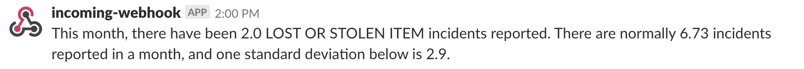

# Introduction
After the University of Nebraska-Lincoln Police department began publishing their Daily Crime and Fire Log online, journalists and other members of the public have been able to view updates almost instantly. They can see what incidents have been reported so far for that day, and they can view any day back to 2005. Using an advanced search, they can also filter the data by date range, location or crime type.  

However, there is no way to analyze the data. There's no way to see how crime reports have evolved over time. Other people have developed programs to look at past trends and outliers to see how things have changed, but there was no way to know when new outliers were happening. The goal of this program is to fill that gap.

This program uses Python to calculate the average number of reports per month for each crime type. Then, as the reports come in each month, it checks to see if any crime type has an abnormally high amount of crimes reported. At the end of the month, it checks to see if an unusually low number of crimes were reported for a crime type.

If an abnormality is found, a message is created and sent to a Slack channel. This allows journalists to be notified of the abnormality. From there, they're able to look into the reports to determine if it is worth a story.

# Background

# Relevance to field
Crime reports are often the focus of news stories. 
# Previous work

# Process
## Downloading the data
To start, I needed to download as much UNLPD data I could get. Using the advanced search function of the Daily Crime and Fire Log, I was able to download data one year at a time, all the way back to 2005. Then, using [`csvkit`](https://csvkit.readthedocs.io/en/1.0.2/), I was able to trim and stack the files.

```bash
in2csv 2005.xls > 2005.csv --skip-lines 8
in2csv 2006.xls > 2006.csv --skip-lines 8
...
in2csv 2017.xls > 2017.csv --skip-lines 8

csvstack 2005.csv 2006.csv > 0506.csv
csvstack 0506.csv 2007.csv > 0507.csv
...
csvstack 0516.csv 2017.csv > all_years.csv
```

`in2csv` converts the downloaded Excel files into csv files, and `--skip-lines 8` removes the unnecessary header at each of the files. `csvstack` joines two files by putting one file's rows at the end of another file.  

## Importing the historical data
The next step was to read the final csv into the data analysis library [`pandas`](https://pandas.pydata.org). I chose `pandas` for this project because of its ability to easily manipulate data and do simple statistics.

```python
all_years = pd.read_csv('original_data/all_years.csv')
```

Side note: `pandas` is often imported into Python scripts using `import pandas as pd`, which renames the library when it's imported. I have followed this trend.

## Checking the data
Once the data is loaded, I wanted to check the validity of it. All of the records should have a case number, a reported date, a location, an amount stolen and an amount damaged. To ensure each record has these values, we can count how many values are present in the data and compare it to the number of rows.

```python
assert df['Case #'].count() == len(df) != 0
assert df['Reported'].count() == len(df) != 0
assert df['Location'].count() == len(df) != 0
assert df['Stolen'].count() == len(df) != 0
assert df['Damaged'].count() == len(df)!= 0
```

These `assert` statements check the count of values against the number of rows, found using the `len()` function. Checking to make sure the values do not equal 0 helps to double check the data downloaded and imported correctly.

## Cleaning the data

This program doesn't work with the stolen and damaged amounts specifically, but I wanted to go ahead and clean them. To be able to treat them as numbers, I had to remove the extra punctuation and convert the data type of the column from string to float. I also needed to convert the Reported column to datetime objects for time-based analysis.

```python
df['Stolen'] = df['Stolen'].str.replace(',','')
df['Stolen'] = df['Stolen'].str.replace('$','')
df['Stolen'] = df['Stolen'].astype(float)
df['Damaged'] = df['Damaged'].str.replace(',','')
df['Damaged'] = df['Damaged'].str.replace('$','')
df['Damaged'] = df['Damaged'].astype(float)

df['Reported'] = pd.to_datetime(df['Reported'])
```

The `replace()` method removes the characters by replacing them with nothing. Then, the `astype()` method converts the Stolen and Damaged columns to float values, and the `to_datetime()` function converts the Reported column to datetime objects.

## Creating a month column
To filter the data by month, I needed to create a column with the month each crime was reported. I decided to filter by month as that would be long enough for trends to appear that wouldn't be obvious to the standard journalist.

```python
df['Month'] = df['Reported'].dt.to_period('M')
df2 = df.set_index(['Reported'])
```

The `to_period()` method returns the time period a datetime is in, and in this case, it's finding the month. That info is saved to a new column named 'Month.' Then, the index of the dataframe is switched to the Reported column to allow slicing by month later.

## Counting the crimes

Next, I needed to count how many crimes were reported for each crime type. I separated the data by crime type, and then I separated it into subsets by month. I counted how many rows were in those subsets and saved it to a dictionary. Then, all those dictionaries were added to a list, which was converted into a `pandas` dataframe. 

```python
#This holds the dictionary for each crime
months_count = []
#For each crime present in the dataframe
for crime in df['Incident Code'].unique():
    print(crime)
    crime_dict = {}
    crime_dict['Crime'] = crime
    #For each month in the dataframe
    for month in df['Month'].unique():
        #Slice the dataframe for one month's data
        month_subset = df[str(month)]
        #Filter the subset for instances of the crime
        crime_subset = month_subset[month_subset['Incident Code'] == crime]
        #Save the count with the month
        crime_dict[str(month)] = len(crime_subset)
    #Append the dictionary to the months_count list
    months_count.append(crime_dict)
#Convert the list into another dataframe
months_count_df = pd.DataFrame(months_count)
```

This is a sample of the result.

Crime | 2005-01 | 2005-02 | 2005-03 | ...
:-----|:-------:|:-------:|:-------:|:---:
LOST OR STOLEN ITEM | 10 | 5 | 8 | ...
FRAUD - CREDIT CARDS/ATM/BANK CARD | 2 | 4 | 2 | ...
ACCIDENTS - P.D. REPORTABLE | 4 | 7 | 4 | ...
... | ... | ... | ... | ...


## Calculating the statistics
With the crimes counted, I could calculate the average number of crimes reported per month. I also calculated the standard deviation to help create an upper and lower threshold for alerts.

```python
#Creates a dataframe with the unique crimes
std_df = df.filter(['Crime'])
#Adds a column with the mean count for each crime
std_df['mean'] = df.mean(axis=1)
#Adds a column with the standard deviation for each crime
std_df['std'] = df.std(axis=1)
#Adds a column with a lower threshold
std_df['lower'] = std_df['mean'] - std_df['std']
#Adds a column with an upper threshold
std_df['upper'] = std_df['mean'] + std_df['std']
```

The `filter()` method created a new dataframe with only the crime types column. The `mean()` method calculates the mean for each row, and `axis=1` ensures it's calculating the mean for each crime type, rather than the mean for each month. That information is saved to a new column. Then, the standard deviation is calculated for each crime type using the `std()` method, and it's saved to a new column.  
The lower bound is calculated by subtracting one standard deviation from the mean, and the upper bound is calculated by adding one standard devation to the mean. I chose to create the thresholds at one standard deviation away, as that seemed to be a good balance between missing outliers and having too many false positives.

## Getting this month's data
Because UNLPD's Daily Crime and Fire Log is a `.asp` page, standard web scraping processes couldn't be used, as the website's URL never changes. Instead, I needed to use [`selenium`](https://pypi.python.org/pypi/selenium), which was developed to automate web browser interaction.

```python
#This is needed to set up selenium
#os.path.expanduser allows the use of a '~'
path_to_chromedriver = os.path.expanduser('~/Downloads/chromedriver')
browser = webdriver.Chrome(executable_path=path_to_chromedriver)
```

`selenium` uses a file called [`chromedriver`](https://sites.google.com/a/chromium.org/chromedriver/downloads) to manipulate an instance of Google Chrome. `os.path.expanduser` allows other users to simply place the file in their Downloads folder without having to change the file path provided.

```python
#The URL to the Daily Crime and Fire Log
url = "https://scsapps.unl.edu/policereports/MainPage.aspx"
#Go to the URL
browser.get(url)
#Find the advanced search button and click it
browser.find_element_by_id('ctl00_ContentPlaceHolder1_AdvancedSearchButton').click()
#Find the first date field, hit tab and hit '01'. 
#This sets the date to the first day of the month
browser.find_element_by_id('ctl00_ContentPlaceHolder1_DateRange_MonthText1').send_keys('\t01')
#Find the search button and click it
browser.find_element_by_id('ctl00_ContentPlaceHolder1_SearchButton').click()
#Switch to the iframe on the page
browser.switch_to.frame(browser.find_element_by_id('ctl00_ContentPlaceHolder1_ViewPort'))
#Find the export button once the iframe loads and click it
export_button = WebDriverWait(browser, 10).until(
    EC.presence_of_element_located((By.ID,'ExportButton'))
)
export_button.click()
```

`selenium` then goes through the pages, filling out the form to get this month's data. The form has automatically moves your cursor when you enter the date. So, to set the beginning date to the first of the month, it finds the field for the first month, hits tab to move to the day field, and enters '01.'  
Then, when it loads the data, it loads it in an `iframe`, which is basically a webpage inside of a webpage. `selenium` has to switch to the `iframe` and then wait for it to load. Once it does, it can click the export button.  
Because the data always downloads with the same filename, it's important the file is deleted before the program is run again. Otherwise, the new file will have '(1)' after it, causing the program to continue using the old data.

## Importing the monthly data
Since we were already maniuplating data in Python, I didn't want the user to have to quit the program to load in the monthly data. So, I used the [`subprocess`](https://docs.python.org/3/library/subprocess.html) library to run the in2csv command. 

```python
#Runs in2csv on the downloaded file and converts it to UTF-8
csv_data = subprocess.check_output(
    ["in2csv", os.path.expanduser("~/Downloads/DailyCrimeLogSummary.xls")]
).decode("utf-8")
#Creates a file instance for pandas to use on the next line
csv_file_instance = StringIO(csv_data)
#Reads in the csv to a dataframe, skipping the first eight rows
month_df = pd.read_csv(csv_file_instance, skiprows=8)
```

`subprocess.checkoutput()` runs the in2csv command and captures the output, which in this case is a csv version of the file. Then using the `decode()` method, I ensured the text was using the UTF-8 character encoding.  
[`StringIO`](https://docs.python.org/3/library/io.html) converts a string of text to a text stream, which `pandas` needs to read it into a data frame.

## Cleaning and counting the data
To clean the monthly data, I used the same process as I used for the historical data. For counting the crimes, I used the same process except for one change.

```python
#Save the count with the word 'Month'
crime_dict['Month'] = len(crime_subset)
```

When saving the crime count to the dictionary, I just save it with the key 'Month.' This allows me to get the count later by just using the key 'Month,' rather than trying to figure out which month it currently is. 

This is a sample of the result.

Crime | Month
:-----|:-----:
ALCOHOL - MINOR IN POSSESSION | 2
LARCENY - STOLEN BIKE | 6
WEAPONS - CONCEALED | 1
... | ... |

## Filtering newsworthy crimes
Now that I had the historical averages and this month's data, the only thing left was to see if this month's data exceeded the thresholds.  
However, there were some crimes that weren't newsworthy that met the threshold because they were so rare. One standard deviation above the mean for False Security Alarms - Mechanical is 0.126. If one crime was reported under that category, it would trigger an alert, but it's not worth a story.  
At the same time, there are crimes that would trigger an alert if they happened once, and they would be newsworthy. For example, one standard deviation above the mean for suicides is also 0.126. But, we figured those reports would be covered anyway, and it would be more obvious if there was a strange spike in those crimes. So, this program focuses on the crimes that happen more than a couple times per month that aren't normally covered by the media. For us, those crimes include:

```python
flagged_crimes = [
        "LOST OR STOLEN ITEM",
        "FRAUD - CREDIT CARDS/ATM/BANK CARD",
        "LARCENY - FROM MOTOR VEHICLE",
        "NARCOTICS - POSSESSION",
        "BURGLARY",
        "LARCENY - FROM BUILDING",
        "ALCOHOL - DWI",
        "ALCOHOL - DRUNK",
        "ALCOHOL - MINOR IN POSSESSION",
        "VANDALISM - OTHER",
        "LARCENY - STOLEN BIKE",
        "VANDALISM - BY GRAFFITI",
        "NARCOTICS - OTHER",
        "NARCOTICS - SALE/DELIVER",
    ]
```

If someone wanted to remove or add a crime, they would just need to remove it from or add it to this list.

## Checking the upper threshold
If crime reports crossed the upper threshold at any point, it would be newsworthy. So, the upper threshold is checked every time the program runs. First, I needed to combine the historical data with the current month's data.

```python
merged = pd.merge(all_years_stats, month_count, on='Crime', how='inner')
```
The `merge()` function combines two dataframes on a common column. In this case, I wanted to join the dataframes on the Crime column. This way, I could have the thresholds and the current counts in the same rows.  
Since I was checking the upper threshold, I only wanted crimes that had occurred this month. So, I used an 'inner' join, which only includes data that is present in both sets.

Next, I needed to check if the current month's count had exceeded the upper threshold.

```python
plural_msg = "This month, there have been {month_total} {crime} incidents reported. There are normally {mean} incidents reported in a month, and one standard deviation {direction} is {bound}."
sing_msg = "This month, there has been {month_total} {crime} incident reported. There are normally {mean} incidents reported in a month, and one standard deviation {direction} is {bound}."

for index, row in merged.iterrows():
    if row['upper'] < row['Month'] and row['Crime'] in flagged_crimes:
        #If it has happened more than once, use plural words
        if row['Month'] != 1:
            plural_msg.format(
                crime=row['Crime'], 
                bound=round(row['upper'], 2), 
                month_total=row['Month'], 
                mean=round(row['mean'], 2),
                direction='above',
            )
        #Otherwise, use singular words
        else:
            message = sing_msg.format(
                crime=row['Crime'], 
                bound=round(row['upper'], 2), 
                month_total=row['Month'], 
                mean=round(row['mean'], 2),
                direction='above',
            )
```

I created two template messages, one with plural words and one with singular words. It iterates through each crime type in the set. If the count for the month is over the upper bound, and if the crime is in the list of flagged_crimes, it will create a message. It checks how many reports there are and uses the appropriate template, substituting in values using the `format()` method.

## Checking the lower threshold

### Checking the last day of the month
The only time to check the lower threshold is at the end of the month. So, I needed a way to check if it was the last day of the month.

```python
def check_last_day():
    #Get today's date
	today = datetime.today()
	#monthrange(year, month) returns weekday of first day of the month and number of days in month, for the specified year and month.
	if today.day == monthrange(today.year, today.month)[1]:
	    return True
	else:
	    return False
```

This function uses the [`datetime`](https://docs.python.org/3/library/datetime.html) library to get today's date. Then, it uses the `monthrange()` function from the [`calendar`](https://docs.python.org/3/library/calendar.html) library to get the last day of the month. If the two are the same, it's the last day of the month.

### Comparing the values
Comparing the month's counts to the lower threshold is similar to checking the upper threshold, but with a couple key changes.

```python
merged = pd.merge(all_years_stats, month_count, on='Crime', how='outer')
```

When joining the two data frames, an outer join is performed. Outer joins keep all information, even when it's not present in one or the other data frames. This allows us to check crime types that have not occurred in a month.

```python
for index, row in merged.iterrows():
	if row['lower'] > row['Month'] and row['Crime'] in flagged_crimes:
	    #If it has happened more than once, use plural words
	    if row['Month'] != 1:
	        message = plural_msg.format(
	            crime=row['Crime'], 
	            bound=round(row['lower'], 2), 
	            month_total=row['Month'], 
	            mean=round(row['mean'], 2),
	            direction='below',
	        )
	    #Otherwise, use singular words
	    else:
	        message = sing_msg.format(
	           crime=row['Crime'], 
	           bound=round(row['lower'], 2), 
	           month_total=row['Month'], 
	           mean=round(row['mean'], 2),
	           direction='below',
	        )
```

Then, I compared the count to the lower threshold, instead of the upper threshold. If the count is lower than the threshold, it will create a message, using the same templates from before.

## Posting to Slack
Having the messages in the program is great, but it requires someone to constantly check to see if something has popped up. Instead, we can send the messages to Slack, alerting people when a new message is created. Slack is a common program for newsrooms to use, so I figured this would be an easy integration for them.

### Setting up Slack
This feature requires a Slack workspace with the ability to add an [Incoming Webhook](my.slack.com/apps/A0F7XDUAZ-incoming-webhooks). Once you add a configuration and choose a channel for it to post to, you're good to go. Just save the Webhook URL as an environment variable `SLACK_URL`, or replace `os.environ.get('SLACK_URL')` with your URL.

```python
slack_url = os.environ.get('SLACK_URL')
```

### Sending the message
If the URL is setup, the only thing left is to send the message.

```python
#Put the message in a dictionary
slack_data = {'text': message}
#Send the message
response = requests.post(
    #Convert the dictionary to a JSON object
    webhook_url, data=json.dumps(slack_data),
    #These headers help Slack interpret the messgae
    headers={'Content-Type': 'application/json'}
)
if response.status_code != 200:
    raise ValueError(
        'Request to slack returned an error {code}, the response is:\n{text}'.format(
            code=response.status_code,
            text=response.text,
        )
    )
```

This uses the [`requests`](https://pypi.python.org/pypi/requests) library to send the message, which is formatted using the [json](https://docs.python.org/3/library/json.html) library. A status code of '200' means it worked, so if it doesn't equal '200,' an error is raised.

Here's an example message.



# Outcome/applications
Why open source vs. proprietary
Address interpretation issues down the road


# Conclusion
